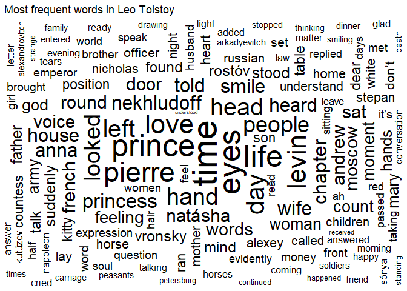
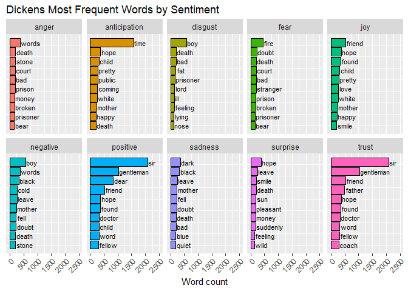
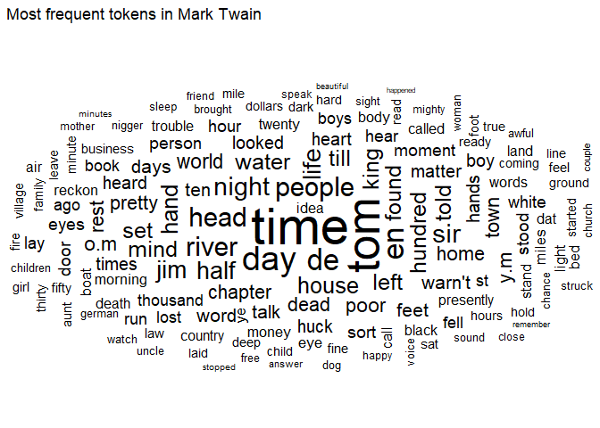
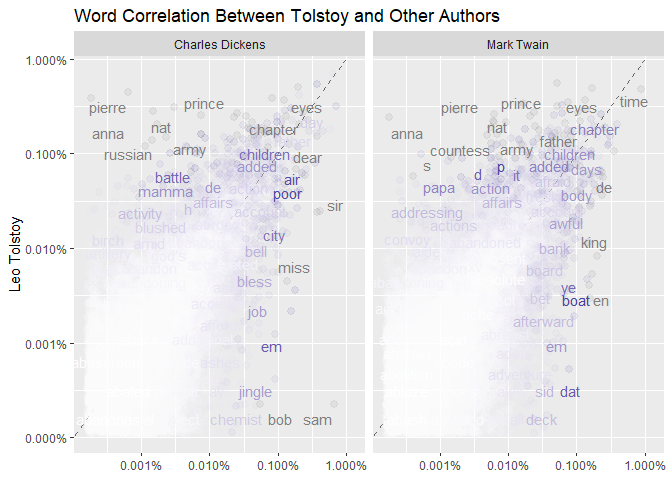
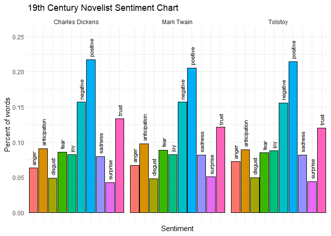

Tolstoy, Dickens, and Twain
================
Gabriel Kahn
6/8/2019

# Introduction

This project will look to compare the works of three of the most
renowned 19th century writers from their respective countries, Leo
Tolstoy from Russia, Charles Dickens from England, and Mark Twain from
the United States. Coming from from the same time period, but different
countries, how do their respective writing styles correlate and differ?
Using the text analysis tools R provides can give us a better picture of
how great authors perform their craft. Each author will be represented
by text data from the eight top results according to Gutenberg.

## Leo Tolstoy

### Russia 1828 - 1910

Leo Tolstoy is considered by many to be one of the greatest novelists of
all time. His famous works include War and Peace and Anna Karenina. He
has been often nominated for the Nobel Prize and was excommunicated from
the church. His style has been described as realistic fiction and he is
noted for the how he can convey complex messages in a lucid manor.

## Word Cloud

<!-- -->

As we see in the other word clouds, time is a central word. This may be
do to its flexibility in use or perhaps due to the structure of the
novel form itself, which describe actions which take place over the
temporal dimension. This cloud is uniquely Russian, we see many Slavic
names, but interestingly enough we also see “Pierre” which suggests that
one of his novels dealt with the French. Knowing Russian history perhaps
he wrote of the Napoleonic Wars.

<!-- -->

There are many interesting conclusions to be drawn from this chart. For
one, we see the association of money with anger, which speaks to how it
can be a strong source for disagreement. The generally positive
associations of family words such as “mother” and "father show perhaps
that family is a source of comfort and happiness in the books. There is
also a dichonomy between black and whitee, with the latter used to
express postive emotions and the former negative. We also see other
tropes such as prison and war show up negatively in the chart.

## Charles Dickens

### England 1812-1870

Charles Dickens is one of the most beloved writers of all time. Through
words he painted pictures of the inequality present during the early
Industrial Revolution. Often humorous and satiric in style, Dickens was
also known to tackle some of the most pressing social issues of his
time.

## Word Cloud

<!-- -->

At first glance, this wordcloud is quite different from Tolstoy’s. It
seems uniquely English; the largest word being “sir”. While “eye” was
prominent in Tolstoy’s work, “hand” and “head” are body parts which take
center place in Dicken’s work.

<!-- -->

Looking at this wordchart, we see most strikingly that time is used as
an anticipatory word, at a significantly higher rate than any other word
for any other feeling. We also see that gentleman is used positively.
Fire is an interesting word to see at the top of the fear column, even
higher than death. “Boy” is used with a strong negative connotation in
Dickens, perhaps characters say it in a paternizing way.

## Mark Twain

### United States 1835 1910

Perhaps the United Stae’s most famous writer, Mak Twain was known for
his humor and simplestic style. Born in Missouri, his subjects often
tackled the hypocracy and oppression prominent in the day.

## Word Cloud

<!-- -->

Like Dicken’s, “head” is also the most prominent body part in the word
cloud. Perhaps this is an aspect of Anglocised writing versus Russian.
The words in this cloud seem quite simple; their are few large words and
the lexicon seems like what the commonperson would use in everyday
speech.

<!-- -->

Like Tolstoy, money is also a cause for anger in the writings of Twain.
We also see the joy of having “found” things, it is the most positively
used word, perhaps conveying the sense of the childhood wonder of
discovery which is a prevalent theme in such works as Tom Sawyer and
Huckleberry Finn. Like Dickens, “fire” is a word used in a fearful
context here. Unlike Tolstoy, we see “mother” appear in the negative
column.

## Author Comparisons

We will now see how these word clouds correlate with each other,
ultimately seeing which authors are most similar in style.

### Tolstoy vs. Others

<!-- -->

### Twain versus Tolstoy

    ## 
    ##  Pearson's product-moment correlation
    ## 
    ## data:  proportion and Tolstoy
    ## t = 109.43, df = 15257, p-value < 2.2e-16
    ## alternative hypothesis: true correlation is not equal to 0
    ## 95 percent confidence interval:
    ##  0.6541278 0.6719096
    ## sample estimates:
    ##       cor 
    ## 0.6631122

### Dickens versus Tolstoy

    ## 
    ##  Pearson's product-moment correlation
    ## 
    ## data:  proportion and Tolstoy
    ## t = 110.94, df = 15141, p-value < 2.2e-16
    ## alternative hypothesis: true correlation is not equal to 0
    ## 95 percent confidence interval:
    ##  0.6607266 0.6783007
    ## sample estimates:
    ##       cor 
    ## 0.6696074

From the word cloud and the product moment correlation, we see that
Tolstoy is more similar to Dickens than he is to Twain, but seemingly
not to a large extent. The correlation coefficients are the same up
until the hundreth place, but with so much data available, this may show
meaningful stylistic comparisons to some extent.

<!-- -->

### Tolstoy versus Dickens

    ## 
    ##  Pearson's product-moment correlation
    ## 
    ## data:  proportion and Charles Dickens
    ## t = 110.94, df = 15141, p-value < 2.2e-16
    ## alternative hypothesis: true correlation is not equal to 0
    ## 95 percent confidence interval:
    ##  0.6607266 0.6783007
    ## sample estimates:
    ##       cor 
    ## 0.6696074

### Twain versus Dickens

    ## 
    ##  Pearson's product-moment correlation
    ## 
    ## data:  proportion and Charles Dickens
    ## t = 119.46, df = 15682, p-value < 2.2e-16
    ## alternative hypothesis: true correlation is not equal to 0
    ## 95 percent confidence interval:
    ##  0.6819734 0.6983628
    ## sample estimates:
    ##       cor 
    ## 0.6902566

While we have already tested the relationship between Tolstoy and
Dickens, we now see the relationship between Twain and Dickens. This
relationship is interesting because it is the largest correlation we
have seen thus far and shows that Dickens and Twain are the most similar
in word choice.

<!-- -->

The above chart allows us to better see the general sentiment of each
other and the result shows that each has similar feeling distributions
to each other. Perhaps this distribution is part of writing a good book
or it may be that many novels tend to follow a similar formula. We see
that positive sentiments tend to outnumber negative by around 35%. Trust
is the highest of the specific sentiments. Surprise and disgust are most
rarely used. Perhaps if these sentiments are overused they lose their
power.
