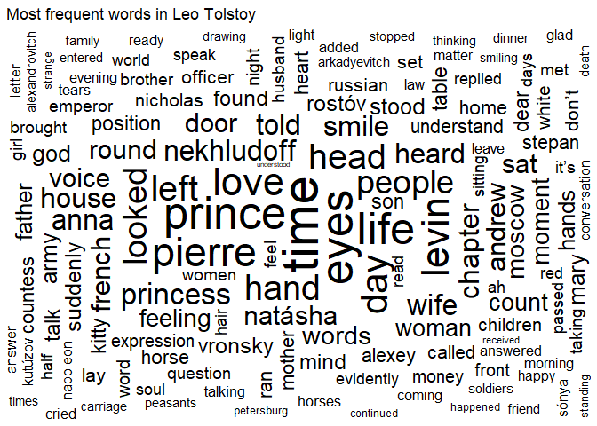
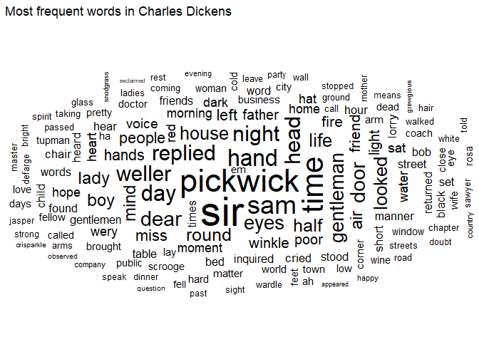
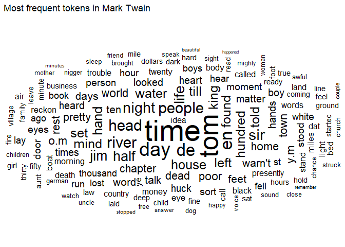
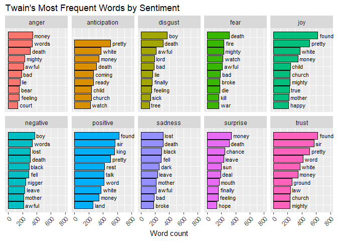
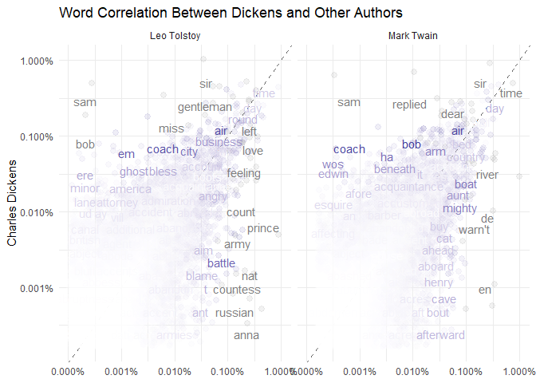

Tolstoy, Dickens, and Twain
================
Gabriel Kahn
6/8/2019

    ## # A tibble: 16,236 x 7
    ##    gutenberg_author~ author   alias birthdate deathdate wikipedia  aliases 
    ##                <int> <chr>    <chr>     <int>     <int> <chr>      <chr>   
    ##  1                 1 United ~ <NA>         NA        NA <NA>       <NA>    
    ##  2                 3 Lincoln~ <NA>       1809      1865 http://en~ United ~
    ##  3                 4 Henry, ~ <NA>       1736      1799 http://en~ <NA>    
    ##  4                 5 Adam, P~ <NA>         NA        NA <NA>       <NA>    
    ##  5                 7 Carroll~ Dodg~      1832      1898 http://en~ <NA>    
    ##  6                 8 United ~ <NA>         NA        NA <NA>       Agency,~
    ##  7                 9 Melvill~ Melv~      1819      1891 http://en~ <NA>    
    ##  8                10 Barrie,~ Barr~      1860      1937 http://en~ <NA>    
    ##  9                12 Smith, ~ Smit~      1805      1844 http://en~ <NA>    
    ## 10                14 Madison~ Unit~      1751      1836 http://en~ <NA>    
    ## # ... with 16,226 more rows

    ## # A tibble: 214 x 8
    ##    gutenberg_id title author gutenberg_autho~ language gutenberg_books~
    ##           <int> <chr> <chr>             <int> <chr>    <chr>           
    ##  1           70 What~ Twain~               53 en       <NA>            
    ##  2           74 The ~ Twain~               53 en       Banned Books fr~
    ##  3           76 Adve~ Twain~               53 en       Best Books Ever~
    ##  4           86 A Co~ Twain~               53 en       Precursors of S~
    ##  5           91 Tom ~ Twain~               53 en       <NA>            
    ##  6           93 Tom ~ Twain~               53 en       <NA>            
    ##  7          102 The ~ Twain~               53 en       <NA>            
    ##  8          119 A Tr~ Twain~               53 en       <NA>            
    ##  9          142 The ~ Twain~               53 en       <NA>            
    ## 10          245 Life~ Twain~               53 en       <NA>            
    ## # ... with 204 more rows, and 2 more variables: rights <chr>,
    ## #   has_text <lgl>

# Introduction

This project will look to compare the works of three of the most
renowned 19th century writers from their respective countries, Leo
Tolstoy from Russia, Charles Dickens from England, and Mark Twain from
the United States. Coming from from the same time period, but different
countries, how do their respective writing styles correlate and differ?
Using the text analysis tools R provides can give us a better picture of
how great authors perform their craft. Each author will be represented
by text data from the eight top results according to Gutenberg.

## Leo Tolstoy

### Russia 1828 - 1910

Leo Tolstoy is considered by many to be one of the greatest novelists of
all time.

## Word Cloud

<!-- -->

## Charles Dickens

### England 1812-1870

## Word Cloud

<!-- -->

## Mark Twain

### United States 1835 1910

What Is Man? and Other Essays Twain, Mark 74 The Adventures of Tom
Sawyer Twain, Mark 76 Adventures of Huckleberry Finn Twain, Mark 86 A
Connecticut Yankee in King Arthur’s Court Twain, Mark 91 Tom Sawyer
Abroad Twain, Mark 93 Tom Sawyer, Detective Twain, Mark 102 The Tragedy
of Pudd’nhead Wilson Twain, Mark 119 A Tramp Abroad Twain, Mark 142 The
$30,000 Bequest, and Other Stories Twain, Mark 245 Life on the
Mississippi

## Word Cloud

<!-- -->

## Author Comparisons

<!-- -->

    ## 
    ##  Pearson's product-moment correlation
    ## 
    ## data:  proportion and Tolstoy
    ## t = 109.43, df = 15257, p-value < 2.2e-16
    ## alternative hypothesis: true correlation is not equal to 0
    ## 95 percent confidence interval:
    ##  0.6541278 0.6719096
    ## sample estimates:
    ##       cor 
    ## 0.6631122

    ## 
    ##  Pearson's product-moment correlation
    ## 
    ## data:  proportion and Tolstoy
    ## t = 110.94, df = 15141, p-value < 2.2e-16
    ## alternative hypothesis: true correlation is not equal to 0
    ## 95 percent confidence interval:
    ##  0.6607266 0.6783007
    ## sample estimates:
    ##       cor 
    ## 0.6696074

<!-- -->

    ## 
    ##  Pearson's product-moment correlation
    ## 
    ## data:  proportion and Charles Dickens
    ## t = 110.94, df = 15141, p-value < 2.2e-16
    ## alternative hypothesis: true correlation is not equal to 0
    ## 95 percent confidence interval:
    ##  0.6607266 0.6783007
    ## sample estimates:
    ##       cor 
    ## 0.6696074

    ## 
    ##  Pearson's product-moment correlation
    ## 
    ## data:  proportion and Charles Dickens
    ## t = 119.46, df = 15682, p-value < 2.2e-16
    ## alternative hypothesis: true correlation is not equal to 0
    ## 95 percent confidence interval:
    ##  0.6819734 0.6983628
    ## sample estimates:
    ##       cor 
    ## 0.6902566
